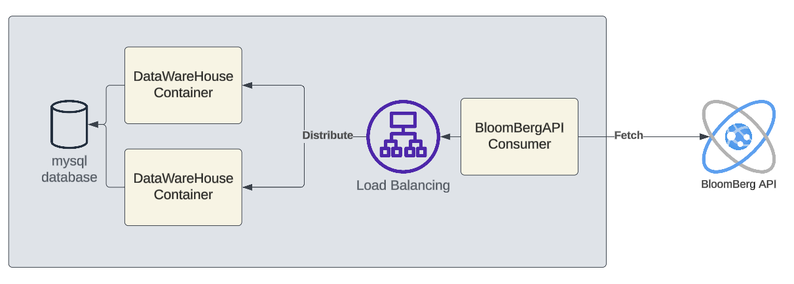
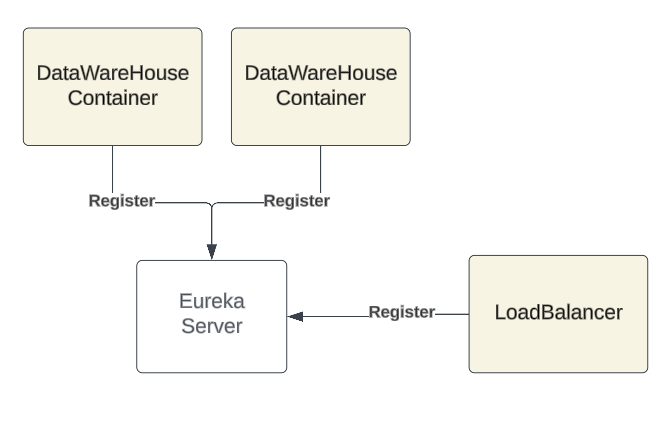
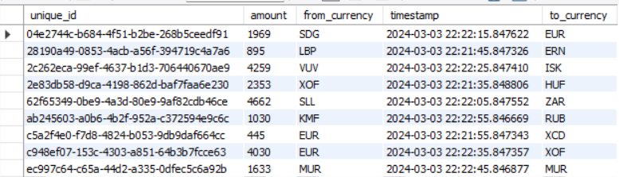

# DataWareHouse Simulator

In this project I created a Datawarehouse Microservice, which is connected to mysql server.
This Microservice saves Fx Deals in database table. Since There is no Fx Deals Data,
I created a different Microservice which it's main purpose is to create random mock fxdeals and send them to Loadbalancer,
for each request the loadbalancer will route the request to one of the replicas ( Datawarehouse ).
<br>

### Application Major Components
* Loadbalancer Module
* DataWareHouse Module
* BloomBergAPI
* EurekaServer
<br>

Each component is represented as a microservice "docker container".
The Image Below shows the overview of the project.



---

I used Spring Boot to implement my microservices with Maven build tool.
Additionally I used these Libraries within SpringBoot:
* **Spring Cloud / Eureka Server**:
  Used to register microservices to allow loadBalancing capability.
  This LoadBalancer implicitly uses RoundRobin Algorithm.



We can simply enable load balancing, but creating a *RestTemplate* object and annotate it with @LoadBalanced
In LoadBalancer Module.

```java
  @Bean("ImportFxDealTemplate")
    @LoadBalanced
    public RestTemplate importFxDealTemplate() {
        return new RestTemplate();
    }
    
```

---
* **Spring Data Validation**:
  Used to validate FxDeals data to prevent missing or incorrect data.
```java
public class FxDealDto {
    
    @NotBlank(message = "UniqueId cant be blank")
    @Size(min = 1, message = "UniqueId cannot be empty")
    private String uniqueId;

    @NotBlank(message = "FromCurrency cant be blank")
    @Size(min = 1, message = "fromCurrency cannot be empty")
    private String fromCurrency;

    @NotBlank(message = "ToCurrency cant be blank")
    @Size(min = 1, message = "toCurrency cannot be empty")
    private String toCurrency;

    @NotNull(message = "Timestamp cant be null")
    private LocalDateTime timestamp;

    @PositiveOrZero(message = "Amount should be greater than or equal to zero")
    private double amount;

}
```
* **Spring Data JPA**:
  Used to establish database connection and execute queries through hibernate implementation.
```java
@Repository
public interface FXDealRepository extends JpaRepository<FXDeal, String> {
}


```
---

### BloomBergAPI Microservice
This service purpose is to randomly generate Fx Deals and send them to LoadBalancer.
I achieved this by scraping currency ISO Codes from a website and put them inside a list,
Then I randomly choose some values from this List to use them as parameters in FxDeal Object.
Scraping is achieved using **Jsoup** library.
I use <div class="background">@Scheduled</div> to generate Fx Deal object every 10 seconds,
and http post the request to loadbalancer.
<div class="note"> <p>This is Just used to Mock LIVE Data fetching</p> </div>

```java
    @Scheduled(fixedRate = 10000)
    public void sendFxDealsToLoadBalancer() throws IOException {

        FxDeal fxDeal = getRandomMockFxDeal();

        String url = "http://load-balancer:8085/loadBalancer/save/fxDeal";

        LOGGER.info("Sending FxDeals with id {} with URL {}", fxDeal.getUniqueId(), url);

        HttpEntity<FxDeal> entity = new HttpEntity<>(fxDeal);
        restTemplate.exchange(url,
                HttpMethod.POST,
                entity,
                Void.class);

    }

    public FxDeal getRandomMockFxDeal() throws IOException {
        Random random = new Random();
        int rand1 = random.nextInt(ISOCodes.size());
        int rand2 = random.nextInt(ISOCodes.size());
        int rand3 = random.nextInt(5000);
        return new FxDeal(UUID.randomUUID().toString(),
                ISOCodes.get(rand1),
                ISOCodes.get(rand2),
                LocalDateTime.now(),
                rand3);
    }
   ```
---

### DataWareHouse MicroService
This service accepts Fx Deals, Validates them and then saves them in database in case they're unique.
```java
  @PostMapping("/save")
    public void importDeal(@RequestBody FxDealDto deal) {

        try {
            LOGGER.info("Validating deal with id {}", deal.getUniqueId());
            fxDealService.validateFxDealDto(deal);
        } catch (Exception e) {
            LOGGER.error("Validation failed for id {}, cause {}", deal.getUniqueId(), e.getMessage());
            return;
        }

        if (fxDealService.exists(deal.getUniqueId())) {
            LOGGER.error("fxDeal with id {} already exists", deal.getUniqueId());
            return;
        }

        if (fxDealService.save(deal)) {
            LOGGER.info("fxDeal with id {} saved successfully", deal.getUniqueId());
        }
    }
```
--- 

### Eureka Server
Used to register eureka clients, in order to achieve loadBalancing.

---

### LoadBalancer 
Distributes the HTTP request which contains the Fx Deal to one of the DataWareHouse 
replicas based on Round-Robin Algorithm.

---

### Makefile
MakeFile is added to run re-occuring scripts, like maven build, or docker-compose up, or docker-compose down.
I added all these rules in the MakeFile

```make

  NAME := ProgressSoft_Project
  BUILD_TOOL := ./mvnw
  
  build :
  	mvn clean install
  
  docker-up : build
  	docker-compose up -d
  docker-down :
  	docker-compose down -d

```
---
### Docker Compose

I created a docker container for each microservice, I created two containers of datawarehouse, but each running on different port.
These containers communicate to each other through docker network. this project can be upgraded using kubernetes to enable auto-scaling -horizental scalling- .

```docker
version: '3.8'

services:
  mysql:
    image: mysql:latest
    restart: always
    container_name: mysql-container
    environment:
      MYSQL_ROOT_PASSWORD: 12321
      MYSQL_DATABASE: fxdeals
    ports:
      - "3307:3306"
  datawarehouse1:
    build: /DataWareHouse
    restart: on-failure
    container_name: datawarehouse1-container
    ports:
      - "8080:8080"
    depends_on:
      - mysql
  datawarehouse2:
    build: /DataWareHouse
    restart: on-failure
    container_name: datawarehouse2-container
    ports:
      - "8081:8080"
    depends_on:
      - mysql
  eureka-server:
    build: /EurekaServer
    image: spring-cloud/eureka
    container_name: eureka-server
    ports:
      - "9090:9090"
  load-balancer:
    build: /LoadBalancer
    container_name: load-balancer
    ports:
      - "8085:8085"
  bloom-berg:
    build: /BloomBergAPI
    container_name: bloom-berg
    ports:
      - "8082:8082"

```

---
### MySQL Server

MySQL server image is also used, but no volumes are made because no need to persist the data. I just made it as a proof of concept.
MySQL server takes time to start, so when springboot containers try to connect they will through an exception,
that's why in the docker-compose I used the property **restart: on-failure**, in this case until mysql server starts up,
Springboot containers will keep trying to connect until they succeed.
you can connect on port 3307 from localhost, or you can use mysql workbench. check table name fxDeals. as you can see in the below image, this shows how data is saved in the table.



<link rel="stylesheet" type="text/css" href="styles.css">
